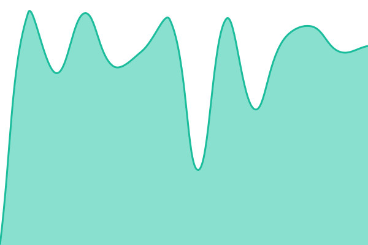

# [📈 Live Status](https://status.ataanai.com): <!--live status--> **🟩 All systems operational**

This repository contains the open-source uptime monitor and status page for [ataanai-code](https://status.ataanai.com), powered by [Upptime](https://github.com/upptime/upptime).

With [Upptime](https://upptime.js.org), you can get your own unlimited and free uptime monitor and status page, powered entirely by a GitHub repository. We use [Issues](https://github.com/ataanai-code/status/issues) as incident reports, [Actions](https://github.com/ataanai-code/status/actions) as uptime monitors, and [Pages](https://status.ataanai.com) for the status page.

<!--start: status pages-->
<!-- This summary is generated by Upptime (https://github.com/upptime/upptime) -->
<!-- Do not edit this manually, your changes will be overwritten -->
<!-- prettier-ignore -->
| URL | Status | History | Response Time | Uptime |
| --- | ------ | ------- | ------------- | ------ |
|  [ATAAN Landing Page](https://ataanai.com) | 🟩 Up | [ataan-landing-page.yml](https://github.com/ataanai-code/status/commits/HEAD/history/ataan-landing-page.yml) | 

 771ms
     
 | 

<a href="https://status.ataanai.com/history/ataan-landing-page">100.00%</a>
    

|  [ATAAN SaaS Dashboard](https://app.ataanai.com) | 🟩 Up | [ataan-saa-s-dashboard.yml](https://github.com/ataanai-code/status/commits/HEAD/history/ataan-saa-s-dashboard.yml) | 

 622ms
     
 | 

<a href="https://status.ataanai.com/history/ataan-saa-s-dashboard">100.00%</a>
    

|  [ATAAN Core API](https://api.ataanai.com/health) | 🟩 Up | [ataan-core-api.yml](https://github.com/ataanai-code/status/commits/HEAD/history/ataan-core-api.yml) | 

 693ms
     
 | 

<a href="https://status.ataanai.com/history/ataan-core-api">100.00%</a>
    

|  [ATAAN Voice Telephony Engine](https://voice.ataanai.com/health) | 🟩 Up | [ataan-voice-telephony-engine.yml](https://github.com/ataanai-code/status/commits/HEAD/history/ataan-voice-telephony-engine.yml) | 

 682ms
     
 | 

<a href="https://status.ataanai.com/history/ataan-voice-telephony-engine">100.00%</a>
    

|  [ATAAN Documentation](https://docs.ataanai.com) | 🟩 Up | [ataan-documentation.yml](https://github.com/ataanai-code/status/commits/HEAD/history/ataan-documentation.yml) | 

 665ms
     
 | 

<a href="https://status.ataanai.com/history/ataan-documentation">100.00%</a>
    

<!--end: status pages-->

[**Visit our status website →**](https://status.ataanai.com)

## 📄 License

- Powered by: [Upptime](https://github.com/upptime/upptime)
- Code: [MIT](./LICENSE) © [Anand Chowdhary](https://anandchowdhary.com)
- Data in the `./history` directory: [Open Database License](https://opendatacommons.org/licenses/odbl/1-0/)
